# Project Design & Overview

## Section 1 - Project Background

### 1.1 Project Name
Dishitout

### 1.2 Description

A cooking recipe app developed under Figma prototype. The app would have two kinds of account, explorer and creator. Explorer allows to search and explore the food recipe which created by food content creators. While the food content creators are able to be subscribed on gaining revenue from subscribers. The project includes all necessary functionality and pages likes signup, login, payment, dashboard, recipe view / creation page, messaging, comments etc. At the same time considering the design of user experience and interface importance.

 

## Section 2 - Project design

### 2.1 Prototype design features

#### 2.1.1 User experience features
|| Features|
|-|-|
|1|Navigate with bottom decent navigation bar|
|2|Navigate with playful navigation wheel|
|3|Personalize profile picture and preferences selection|
|4|Navigate with dragging button on sub-items page|
|5|Content navigation through vertical and horizontal dragging|
|6|Poka-Yoke bottom-most placement design on important button confirmation|
|7|Star and Thumb rating chip component for popularity indicator|
|8|Discrete color tone classifying rating, likes, subscription and comments|

#### 2.1.2 Explorer account features
|| Features|
|-|-|
|1|Create an account as explorer with authentication|
|2|Able to search recipe by name, creators and keywords|
|3|Able to filter recipe by cuisine, meal types and levels|
|4|Able to save recipes|
|5|Able to subscribe creators|
|6|Explore recipe with cooking steps with media support|
|7|Able to change account settings and preferences|
|8|Able to give Likes and comments to recipe|
|9|Recent exploring recipe storage|
|10|Liked and commented recipe storage|
|11|Able to message subscribed creators|

#### 2.1.3 Creator account features
|| Features|
|-|-|
|1|Includes all the features from Explorer|
|2|View posted recipe and top rated recipe|
|3|View the subscribers list|
|4|Create creator profolio page|
|5|Profile metrics on recipe subscription revenue, post / recipe rating summary and subscribers statistics|

### 2.2 Work Flow Diagram
[Work Flow Full Image Here](./images/DishitOut_Userflow.png)

 

## Section 3 - Tools & IDE Utilization

|Tools| Description|
|-|-|
|Microsoft One Note| Simple UI outline drawing|
|Balsamiq| Wireframe|
|Figma| Application prototype|

 

## Section 4 - Simple UI Outline Drawing

  <a href="https://drive.google.com/file/d/1GskXrPNXjSw3_ppVrP8clMu07rnDm7O1/view?usp=drive_link" target="_blank" rel="noopener noreferrer">
    🔗 <strong>Full Outline Document Here</strong>
  </a>

Example images

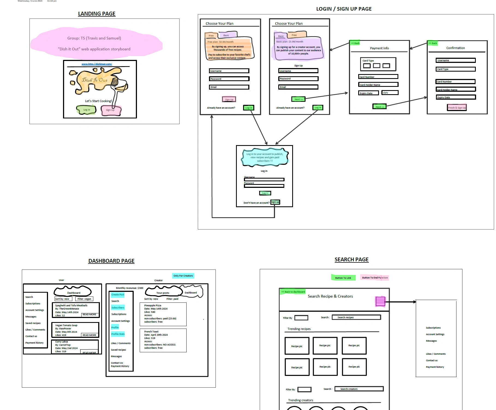

 

## Section 5 - Wireframe

  <a href="https://drive.google.com/file/d/15M9muYa7LjofSVf-M6nt6hAchzIAOyD6/view?usp=drive_link" target="_blank" rel="noopener noreferrer">
    🔗 <strong>Full Wireframe Document Here</strong>
  </a>

 

Example images

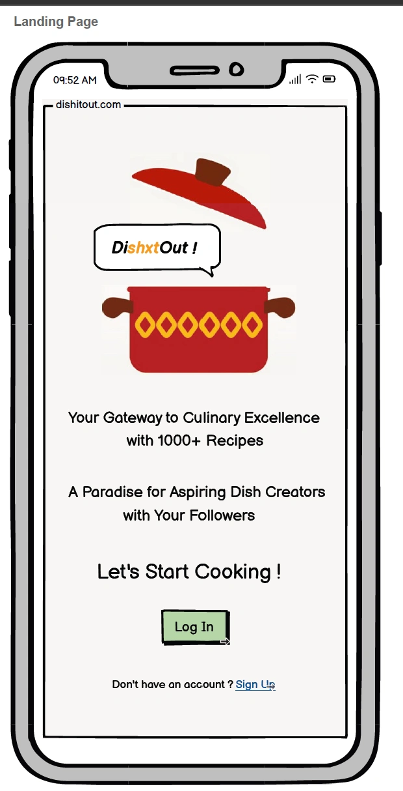

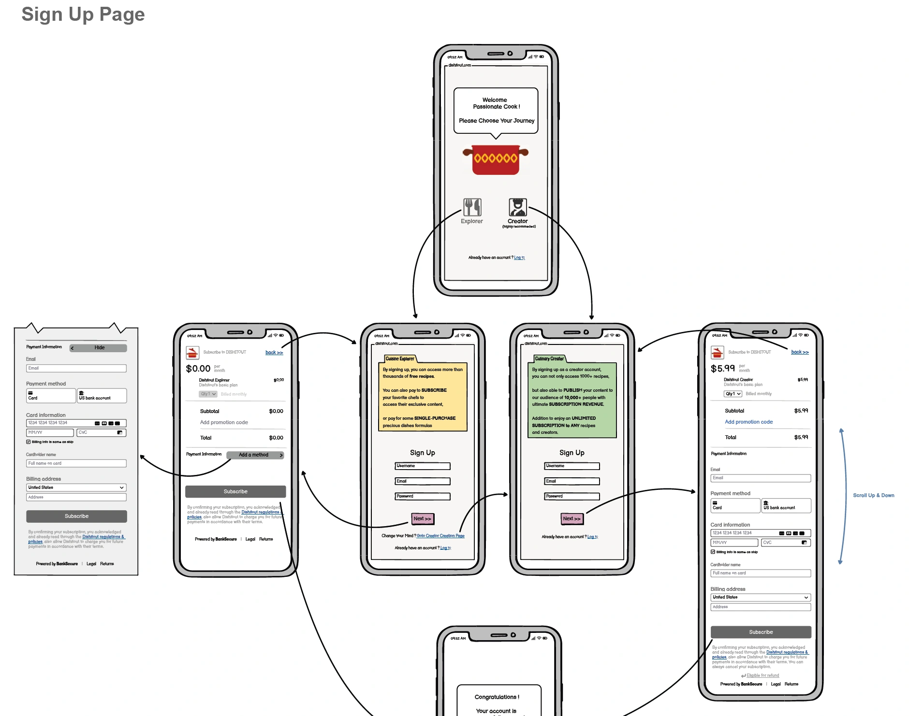

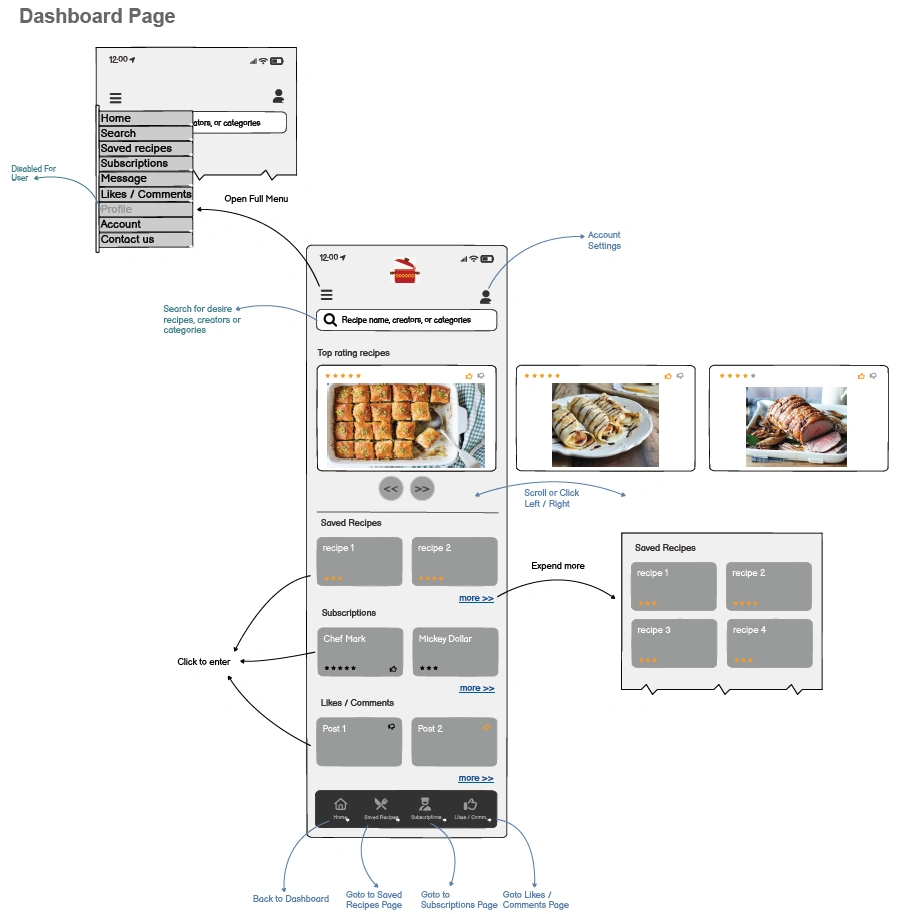

 

## Section 6 - Prototype

  <a href="https://www.figma.com/design/fegnsXwNAZFwTAnxbBGhV8/DishitOut-App?node-id=1-35&t=nILCYk28uJsHVMRu-1" target="_blank" rel="noopener noreferrer">
    🔗 <strong>Full Figma Prototype Workout Here</strong>
  </a>

  <a href="https://www.figma.com/proto/fegnsXwNAZFwTAnxbBGhV8/DishitOut-App?node-id=1249-5821&p=f&t=QnyZtFIhl3VkUeJz-1&scaling=scale-down&content-scaling=fixed&page-id=1%3A35&starting-point-node-id=1249%3A5821&show-proto-sidebar=1" target="_blank" rel="noopener noreferrer">
    🔗 <strong>Deployed Prototype Here</strong>
  </a>

 

Example images

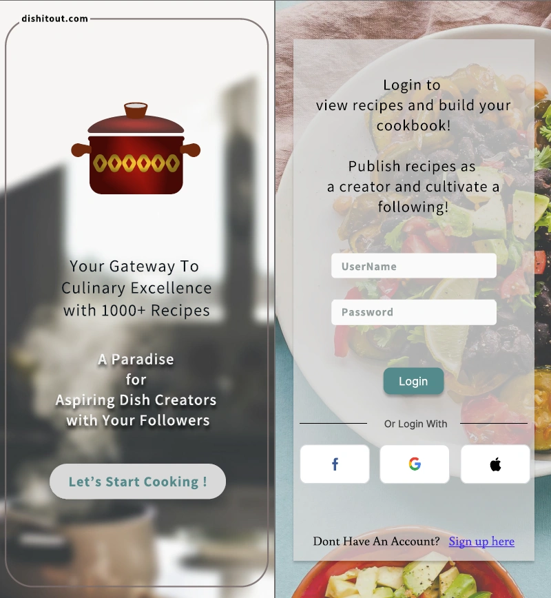

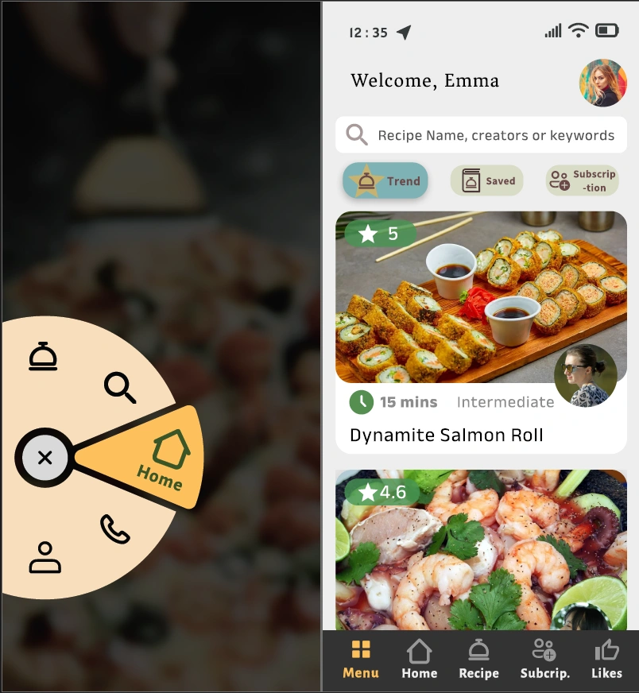

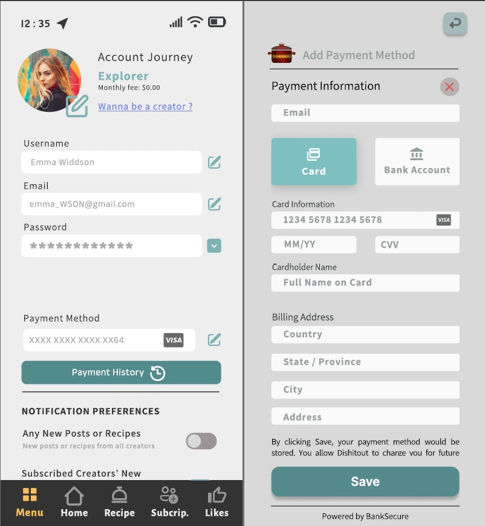

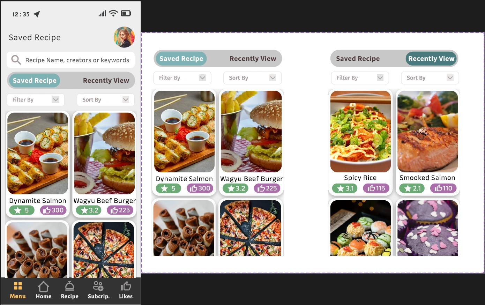

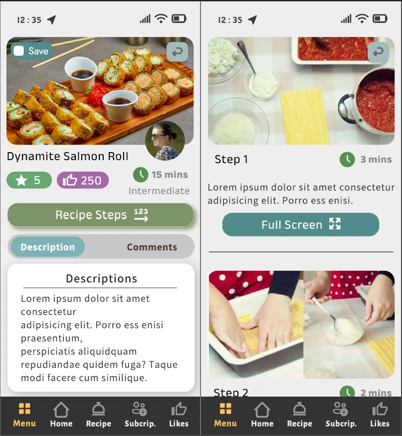

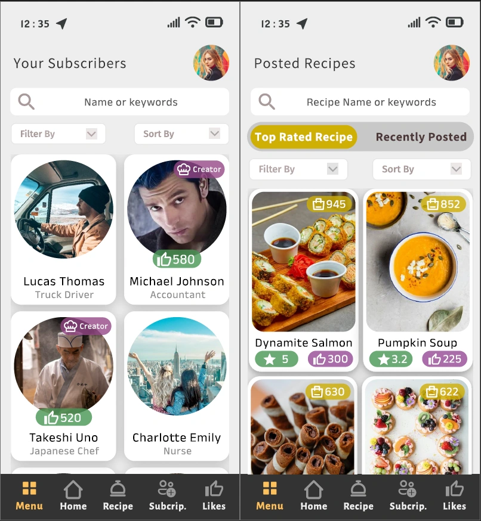

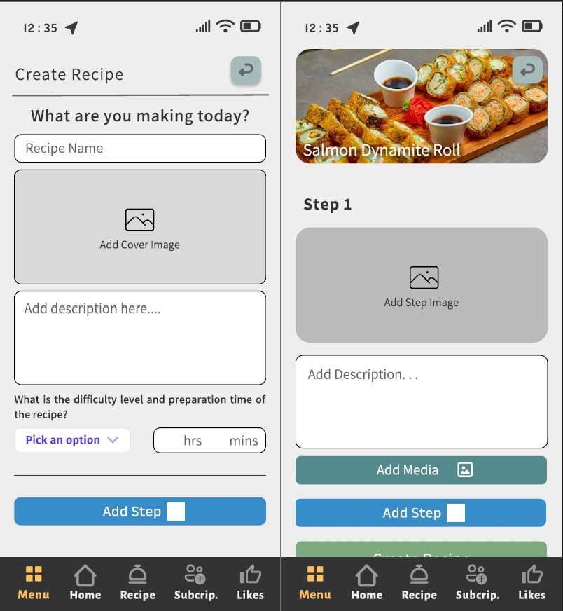

 

## END of Document
